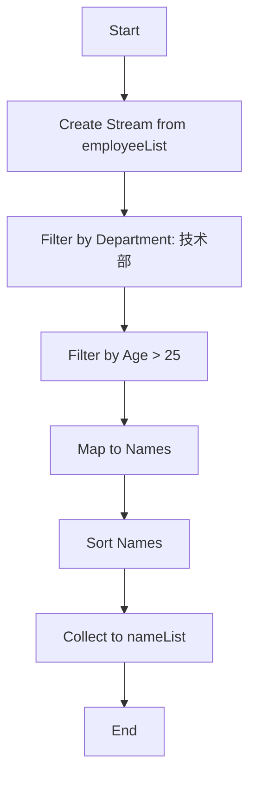

我们来系统地复习一下 Java Stream 流。这是一种在 Java 8 中引入的 API，用于以声明式方式处理数据集合（如 List、Set、Map 等）。它可以让你写出更简洁、更易读、更高效的代码。

---

### 第一部分：核心概念

**1. 什么是 Stream？**
Stream（流）是一个来自数据源（如集合、数组）的元素队列，并支持聚合操作。它自己**不存储数据**，而是通过一个计算管道来处理数据。

**2. 流的特点**
*   **不是数据结构**：它本身不存储任何数据，数据来自其源（如集合）。
*   **函数式风格**：对流的操作会产生一个结果，但不会修改其源。例如，对一个集合进行过滤，会生成一个新的流，而不是删除集合中的元素。
*   **惰性执行**：许多流操作（如过滤、映射）可以是“惰性的”，这意味着它们只有在需要结果时才会执行。
*   **只能遍历一次**：像迭代器一样，流在生命周期内只能被消费一次。一旦遍历结束，流就关闭了。如果你想再次操作，必须重新创建流。
*   **可并行化**：流操作可以透明地利用多核架构，你只需要将 `stream()` 改为 `parallelStream()`，而逻辑代码无需改变。


**3. 流的操作流程**
流的操作分为两个阶段，连接起来形成一个“流管道”。
1.  **中间操作**：返回一个新的流，可以连续多个。它们是惰性的，不立即执行。
    *   例如：`filter()`, `map()`, `sorted()`, `distinct()`, `limit()`
2.  **终端操作**：返回一个非流的结果（如 `void`、`List`、`Optional`、`Integer` 等）。它会触发整个流水线的实际执行。
    *   例如：`forEach()`, `collect()`, `count()`, `reduce()`, `findFirst()`

**流程示意图：**
`数据源 -> (中间操作1 -> 中间操作2 -> ...) -> 终端操作 -> 结果`

---

### 第二部分：实际应用问题

让我们通过一个具体的例子来应用这些概念。

**问题场景：**
我们有一个 `Employee`（员工）类，包含以下属性：`id`（编号）、`name`（姓名）、`age`（年龄）、`salary`（薪资）、`department`（部门）。
我们有一个包含多个员工的 List。

**目标：**
1.  找出所有在“技术部”且年龄大于 25 岁的员工。
2.  提取出这些员工的姓名。
3.  将这些姓名按字母顺序排序。
4.  将最终结果收集到一个新的 List 中。

**传统方式（循环和条件判断）：**
```java
List<Employee> filteredList = new ArrayList<>();
for (Employee emp : employeeList) {
    if ("技术部".equals(emp.getDepartment()) && emp.getAge() > 25) {
        filteredList.add(emp);
    }
}

List<String> nameList = new ArrayList<>();
for (Employee emp : filteredList) {
    nameList.add(emp.getName());
}

Collections.sort(nameList);
```

**Stream 方式：**
```java
List<String> result = employeeList.stream() // 1. 创建流
        .filter(emp -> "技术部".equals(emp.getDepartment())) // 2. 中间操作：过滤部门
        .filter(emp -> emp.getAge() > 25) // 3. 中间操作：过滤年龄
        .map(Employee::getName) // 4. 中间操作：将Employee对象映射为其姓名（String）
        .sorted() // 5. 中间操作：对姓名进行自然排序
        .collect(Collectors.toList()); // 6. 终端操作：将结果收集到List中
```
**stream流的流程图**



**代码分析：**
*   `stream()`：从 `employeeList` 创建流。
*   `filter(...)`：两个连续的过滤操作，是中间操作。它们会等待终端操作的触发。
*   `map(Employee::getName)`：这是一个关键的中间操作。它将流中的 `Employee` 元素转换为 `String`（员工姓名）元素。现在流的类型从 `Stream<Employee>` 变成了 `Stream<String>`。
*   `sorted()`：对 `Stream<String>` 中的字符串进行排序。
*   `collect(Collectors.toList())`：这是终端操作。它触发了前面所有中间操作的执行，并将最终的 `Stream<String>` 收集到一个 `List<String>` 中。

可以看到，Stream 代码更加**声明式**（“做什么”而不是“怎么做”），逻辑清晰，一气呵成，并且没有改变原始的 `employeeList`。

---

### 第三部分：常用的流使用方式

这里列出一些最常用和强大的流操作组合。

**1. 过滤与收集**
```java
// 找出所有薪资超过 10000 的员工
List<Employee> wellPaid = employeeList.stream()
        .filter(emp -> emp.getSalary() > 10000)
        .collect(Collectors.toList());

// 获取所有不同的部门
Set<String> departments = employeeList.stream()
        .map(Employee::getDepartment)
        .collect(Collectors.toSet()); // 用Set自动去重
```

**2. 映射（提取信息或转换）**
```java
// 获取所有员工的姓名列表
List<String> names = employeeList.stream()
        .map(Employee::getName) // 方法引用，等价于 .map(emp -> emp.getName())
        .collect(Collectors.toList());

// 将每个员工的姓名转换为大写
List<String> upperCaseNames = employeeList.stream()
        .map(Employee::getName)
        .map(String::toUpperCase)
        .collect(Collectors.toList());
```

**3. 查找与匹配**
```java
// 检查是否有员工在“财务部”
boolean hasFinance = employeeList.stream()
        .anyMatch(emp -> "财务部".equals(emp.getDepartment()));

// 检查是否所有员工都大于18岁
boolean allAdult = employeeList.stream()
        .allMatch(emp -> emp.getAge() >= 18);

// 查找第一个在“人事部”的员工
Optional<Employee> firstHr = employeeList.stream()
        .filter(emp -> "人事部".equals(emp.getDepartment()))
        .findFirst();
// 使用Optional安全地处理结果
firstHr.ifPresent(emp -> System.out.println(emp.getName()));
```

**4. 归约与聚合**
```java
// 计算技术部员工的平均薪资
OptionalDouble avgSalary = employeeList.stream()
        .filter(emp -> "技术部".equals(emp.getDepartment()))
        .mapToDouble(Employee::getSalary) // 转换为DoubleStream，有专门的统计方法
        .average();

// 计算公司总薪资支出
double totalSalary = employeeList.stream()
        .mapToDouble(Employee::getSalary)
        .sum();

// 找出薪资最高的员工
Optional<Employee> topEarner = employeeList.stream()
        .max(Comparator.comparingDouble(Employee::getSalary));
```

**5. 分组**
```java
// 按部门对员工进行分组
Map<String, List<Employee>> byDept = employeeList.stream()
        .collect(Collectors.groupingBy(Employee::getDepartment));

// 按薪资范围分组（例如：<5000, 5000-10000, >10000）
Map<String, List<Employee>> bySalaryRange = employeeList.stream()
        .collect(Collectors.groupingBy(emp -> {
            if (emp.getSalary() < 5000) return "低";
            else if (emp.getSalary() <= 10000) return "中";
            else return "高";
        }));
```

**6. 链式操作的综合示例**
```java
// 统计技术部员工的数量
long count = employeeList.stream()
        .filter(emp -> "技术部".equals(emp.getDepartment()))
        .count();

// 获取技术部员工姓名，按薪资降序排列的前3名
List<String> topTechNames = employeeList.stream()
        .filter(emp -> "技术部".equals(emp.getDepartment()))
        .sorted(Comparator.comparingDouble(Employee::getSalary).reversed())
        .limit(3)
        .map(Employee::getName)
        .collect(Collectors.toList());
```

### 总结

Java Stream API 的核心在于 **声明式编程** 和 **函数式组合**。通过将多个简单的中间操作（`filter`, `map`, `sorted`）连接起来，最后以一个终端操作（`collect`, `forEach`, `count`）收尾，你可以构建出非常强大且易读的数据处理管道。

多加练习，你会发现自己处理集合数据的代码会变得异常简洁和优雅。