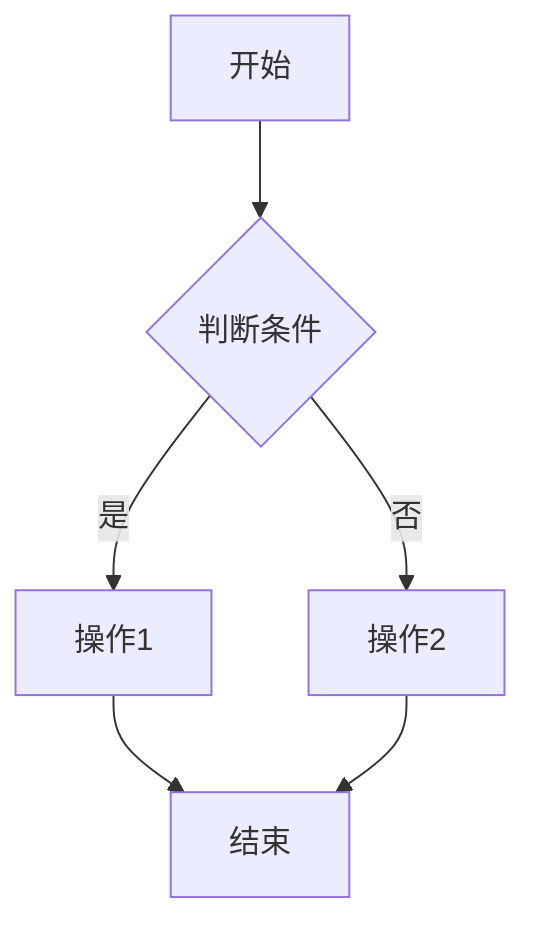
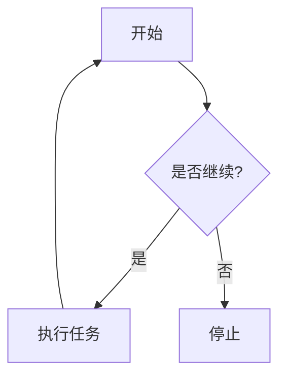

# 我的流程图文章

以下是一个简单的流程图：

```mermaid
graph TD;
    A[开始] --> B{判断条件};
    B -->|是| C[操作1];
    B -->|否| D[操作2];
    C --> E[结束];
    D --> E;
```

```mermaid
graph TD;
    A[开始] --> B{是否继续?};
    B -- 是 --> C[执行任务];
    B -- 否 --> D[停止];
    C --> A;
```

