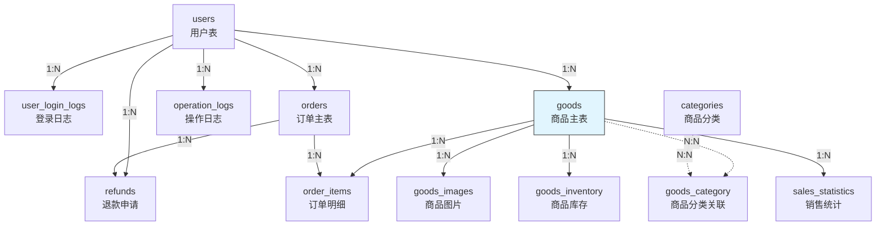

根据您提供的三张用例图，我们可以分析出一个典型的**商城管理系统**，涉及三个主要角色：

 **用户（普通用户）**  
 **商品管理员**  
 **超级管理员**

系统功能模块包括：  
- 用户：账号管理、商品浏览、下单、退款等  
- 商品管理员：商品上架、下架、分类管理、库存管理等  
- 超级管理员：账号管理、注销账号、操作日志等  

---

### 一、系统整体功能分析（基于用例图）

| 角色 | 用例 |
|------|------|
| **用户** | 登录账号、注销账号、账号管理、浏览商品、商品消费（下单、查看订单、退款） |
| **商品管理员** | 录入商品信息、编辑商品信息、设置商品分类标签、执行上架下架、数据监控、查看商品销量/库存 |
| **超级管理员** | 管理信息、查看操作日志、数据概览 |

---

### 二、MySQL 数据库表设计

以下是根据用例图推导出的 **核心数据表**，共 **12 张表**，覆盖用户、商品、订单、分类、库存、日志等功能。

---

##  `users` - 用户表  
**作用**：存储所有系统用户（包括普通用户、商品管理员、超级管理员）的基础信息。

| 字段名 | 类型 | 约束 | 说明 |
|--------|------|------|------|
| `user_id` | BIGINT | PK, AUTO_INCREMENT | 用户ID |
| `username` | VARCHAR(50) | UNIQUE, NOT NULL | 用户名 |
| `password` | VARCHAR(255) | NOT NULL | 加密后的密码 |
| `nickname` | VARCHAR(50) | | 昵称 |
| `email` | VARCHAR(100) | UNIQUE | 邮箱 |
| `phone` | VARCHAR(20) | | 手机号 |
| `role` | ENUM('user', 'goods_admin', 'super_admin') | NOT NULL | 角色：普通用户 / 商品管理员 / 超级管理员 |
| `status` | TINYINT | DEFAULT 1 | 状态：1启用，0禁用 |
| `created_at` | DATETIME | DEFAULT CURRENT_TIMESTAMP | 注册时间 |
| `updated_at` | DATETIME | ON UPDATE CURRENT_TIMESTAMP | 更新时间 |

---

##  `user_login_logs` - 用户登录日志表  
**作用**：记录用户登录行为（超级管理员可查看）。

| 字段名 | 类型 | 约束 | 说明 |
|--------|------|------|------|
| `log_id` | BIGINT | PK, AUTO_INCREMENT | 日志ID |
| `user_id` | BIGINT | FK → users.user_id | 用户ID |
| `login_time` | DATETIME | NOT NULL | 登录时间 |
| `ip_address` | VARCHAR(45) | | IP地址 |
| `device` | VARCHAR(100) | | 设备信息 |

---

##  `categories` - 商品分类表  
**作用**：存储商品分类（如电子产品、服装等），支持多级分类。

| 字段名 | 类型 | 约束 | 说明 |
|--------|------|------|------|
| `category_id` | INT | PK, AUTO_INCREMENT | 分类ID |
| `name` | VARCHAR(50) | NOT NULL | 分类名称 |
| `parent_id` | INT | FK → categories.category_id | 父分类ID（0为一级分类） |
| `level` | TINYINT | NOT NULL | 层级（1,2,..） |
| `sort_order` | INT | DEFAULT 0 | 排序权重 |

---

##  `goods` - 商品主表  
**作用**：存储商品基本信息。

| 字段名 | 类型 | 约束 | 说明 |
|--------|------|------|------|
| `goods_id` | BIGINT | PK, AUTO_INCREMENT | 商品ID |
| `title` | VARCHAR(200) | NOT NULL | 商品标题 |
| `description` | TEXT | | 商品描述 |
| `main_image` | VARCHAR(255) | | 主图URL |
| `price` | DECIMAL(10,2) | NOT NULL | 售价 |
| `original_price` | DECIMAL(10,2) | | 原价 |
| `status` | ENUM('on_sale', 'off_sale', 'deleted') | DEFAULT 'off_sale' | 状态：上架/下架/删除 |
| `admin_id` | BIGINT | FK → users.user_id | 录入管理员ID |
| `created_at` | DATETIME | DEFAULT CURRENT_TIMESTAMP | 创建时间 |
| `updated_at` | DATETIME | ON UPDATE CURRENT_TIMESTAMP | 更新时间 |

---

##  `goods_images` - 商品图片表  
**作用**：存储商品多张图片（轮播图等）。

| 字段名 | 类型 | 约束 | 说明 |
|--------|------|------|------|
| `image_id` | BIGINT | PK, AUTO_INCREMENT | 图片ID |
| `goods_id` | BIGINT | FK → goods.goods_id | 商品ID |
| `image_url` | VARCHAR(255) | NOT NULL | 图片链接 |
| `sort_order` | INT | DEFAULT 0 | 排序 |

---

##  `goods_category` - 商品分类关联表（多对多）  
**作用**：一个商品可属于多个分类。

| 字段名 | 类型 | 约束 | 说明 |
|--------|------|------|------|
| `goods_id` | BIGINT | FK → goods.goods_id | 商品ID |
| `category_id` | INT | FK → categories.category_id | 分类ID |
| PRIMARY KEY (`goods_id`, `category_id`) | | 联合主键 | |

---

##  `goods_inventory` - 商品库存表  
**作用**：管理商品库存，支持多规格（后续可扩展为SKU表）。

| 字段名 | 类型 | 约束 | 说明 |
|--------|------|------|------|
| `inventory_id` | BIGINT | PK, AUTO_INCREMENT | 库存ID |
| `goods_id` | BIGINT | FK → goods.goods_id | 商品ID |
| `sku` | VARCHAR(100) | UNIQUE | 规格编码（如颜色+尺寸） |
| `stock` | INT | DEFAULT 0 | 库存数量 |
| `spec_detail` | JSON | | 规格详情（如 {"color": "红", "size": "XL"}） |

> 注：若需复杂SKU，可拆分为 `goods_sku` + `sku_spec` 表，此处简化。

---

##  `orders` - 订单主表  
**作用**：存储用户下单信息。

| 字段名 | 类型 | 约束 | 说明 |
|--------|------|------|------|
| `order_id` | BIGINT | PK, AUTO_INCREMENT | 订单ID |
| `user_id` | BIGINT | FK → users.user_id | 下单用户 |
| `order_no` | VARCHAR(50) | UNIQUE, NOT NULL | 订单编号 |
| `total_amount` | DECIMAL(10,2) | NOT NULL | 总金额 |
| `status` | ENUM('pending', 'paid', 'shipped', 'completed', 'refunded', 'canceled') | DEFAULT 'pending' | 订单状态 |
| `address` | VARCHAR(255) | | 收货地址 |
| `receiver` | VARCHAR(50) | | 收货人 |
| `phone` | VARCHAR(20) | | 联系电话 |
| `created_at` | DATETIME | DEFAULT CURRENT_TIMESTAMP | 下单时间 |
| `paid_at` | DATETIME | | 支付时间 |

---

##  `order_items` - 订单商品明细表  
**作用**：记录订单中购买的每个商品。

| 字段名 | 类型 | 约束 | 说明 |
|--------|------|------|------|
| `item_id` | BIGINT | PK, AUTO_INCREMENT | 明细ID |
| `order_id` | BIGINT | FK → orders.order_id | 订单ID |
| `goods_id` | BIGINT | FK → goods.goods_id | 商品ID |
| `sku` | VARCHAR(100) | | 购买的规格 |
| `quantity` | INT | NOT NULL | 购买数量 |
| `price` | DECIMAL(10,2) | NOT NULL | 成交单价 |
| `goods_title` | VARCHAR(200) | | 快照：下单时商品名称 |
| `goods_image` | VARCHAR(255) | | 快照：主图 |

---

##  `refunds` - 退款申请表  
**作用**：处理用户退款请求。

| 字段名 | 类型 | 约束 | 说明 |
|--------|------|------|------|
| `refund_id` | BIGINT | PK, AUTO_INCREMENT | 退款ID |
| `order_id` | BIGINT | FK → orders.order_id | 订单ID |
| `user_id` | BIGINT | FK → users.user_id | 申请人 |
| `reason` | VARCHAR(255) | | 退款原因 |
| `amount` | DECIMAL(10,2) | NOT NULL | 退款金额 |
| `status` | ENUM('pending', 'approved', 'rejected', 'completed') | DEFAULT 'pending' | 状态 |
| `applied_at` | DATETIME | DEFAULT CURRENT_TIMESTAMP | 申请时间 |
| `processed_at` | DATETIME | | 处理时间 |

---

##  `operation_logs` - 操作日志表  
**作用**：超级管理员可查看所有管理员的操作记录（商品上下架、账号注销等）。

| 字段名 | 类型 | 约束 | 说明 |
|--------|------|------|------|
| `log_id` | BIGINT | PK, AUTO_INCREMENT | 日志ID |
| `admin_id` | BIGINT | FK → users.user_id | 操作管理员 |
| `action` | VARCHAR(100) | NOT NULL | 操作类型（如：上架商品、注销账号） |
| `target_id` | BIGINT | | 目标ID（如商品ID、用户ID） |
| `target_type` | VARCHAR(50) | | 目标类型（goods/user） |
| `description` | TEXT | | 操作详情 |
| `ip_address` | VARCHAR(45) | | 操作IP |
| `created_at` | DATETIME | DEFAULT CURRENT_TIMESTAMP | 操作时间 |

---

##  `sales_statistics` - 销售统计表（可选，供数据监控）  
**作用**：商品管理员查看销量、库存等统计数据。

| 字段名 | 类型 | 约束 | 说明 |
|--------|------|------|------|
| `stat_id` | BIGINT | PK, AUTO_INCREMENT | 统计ID |
| `goods_id` | BIGINT | FK → goods.goods_id | 商品ID |
| `date` | DATE | NOT NULL | 统计日期 |
| `sales_count` | INT | DEFAULT 0 | 当日销量 |
| `view_count` | INT | DEFAULT 0 | 浏览量（可通过埋点） |
| `stock_remaining` | INT | | 剩余库存快照 |

> 可通过定时任务每日更新，或触发器维护。

---

### 总结：表关系（ER关系）



---

### 补充建议

 **索引优化**：
   - `goods(status, created_at)`：快速查询上架商品
   - `orders(user_id, status)`：用户查订单
   - `operation_logs(admin_id, created_at)`：日志查询

 **密码加密**：使用 `bcrypt` 或 `argon2` 存储 `password`

 **软删除**：`goods` 和 `users` 使用 `status` 字段而非物理删除

 **事务控制**：下单扣库存、退款加库存需事务保证一致性

---


## 建表语句

```sql
-- 设置字符集和存储引擎
SET NAMES utf8mb4;
SET FOREIGN_KEY_CHECKS = 0;

-- ==============================
-- 1. 用户表
-- ==============================
DROP TABLE IF EXISTS `users`;
CREATE TABLE `users` (
  `user_id` BIGINT UNSIGNED NOT NULL AUTO_INCREMENT COMMENT '用户ID',
  `username` VARCHAR(50) NOT NULL UNIQUE COMMENT '用户名',
  `password` VARCHAR(255) NOT NULL COMMENT '加密密码',
  `nickname` VARCHAR(50) DEFAULT NULL COMMENT '昵称',
  `email` VARCHAR(100) DEFAULT NULL UNIQUE COMMENT '邮箱',
  `phone` VARCHAR(20) DEFAULT NULL COMMENT '手机号',
  `role` ENUM('user', 'goods_admin', 'super_admin') NOT NULL DEFAULT 'user' COMMENT '角色',
  `status` TINYINT NOT NULL DEFAULT 1 COMMENT '状态：1启用，0禁用',
  `created_at` DATETIME NOT NULL DEFAULT CURRENT_TIMESTAMP COMMENT '注册时间',
  `updated_at` DATETIME NOT NULL DEFAULT CURRENT_TIMESTAMP ON UPDATE CURRENT_TIMESTAMP COMMENT '更新时间',
  PRIMARY KEY (`user_id`),
  INDEX `idx_username` (`username`),
  INDEX `idx_role_status` (`role`, `status`)
) ENGINE=InnoDB DEFAULT CHARSET=utf8mb4 COMMENT='用户表';


-- ==============================
-- 2. 用户登录日志表
-- ==============================
DROP TABLE IF EXISTS `user_login_logs`;
CREATE TABLE `user_login_logs` (
  `log_id` BIGINT UNSIGNED NOT NULL AUTO_INCREMENT COMMENT '日志ID',
  `user_id` BIGINT UNSIGNED NOT NULL COMMENT '用户ID',
  `login_time` DATETIME NOT NULL DEFAULT CURRENT_TIMESTAMP COMMENT '登录时间',
  `ip_address` VARCHAR(45) DEFAULT NULL COMMENT 'IP地址',
  `device` VARCHAR(100) DEFAULT NULL COMMENT '设备信息',
  PRIMARY KEY (`log_id`),
  INDEX `idx_user_time` (`user_id`, `login_time`),
  CONSTRAINT `fk_login_user` FOREIGN KEY (`user_id`) REFERENCES `users`(`user_id`) ON DELETE CASCADE
) ENGINE=InnoDB DEFAULT CHARSET=utf8mb4 COMMENT='用户登录日志';


-- ==============================
-- 3. 商品分类表（支持多级）
-- ==============================
DROP TABLE IF EXISTS `categories`;
CREATE TABLE `categories` (
  `category_id` INT UNSIGNED NOT NULL AUTO_INCREMENT COMMENT '分类ID',
  `name` VARCHAR(50) NOT NULL COMMENT '分类名称',
  `parent_id` INT UNSIGNED DEFAULT 0 COMMENT '父分类ID，0为一级分类',
  `level` TINYINT NOT NULL DEFAULT 1 COMMENT '层级',
  `sort_order` INT NOT NULL DEFAULT 0 COMMENT '排序权重',
  PRIMARY KEY (`category_id`),
  INDEX `idx_parent` (`parent_id`),
  INDEX `idx_level_sort` (`level`, `sort_order`)
) ENGINE=InnoDB DEFAULT CHARSET=utf8mb4 COMMENT='商品分类表';


-- ==============================
-- 4. 商品主表
-- ==============================
DROP TABLE IF EXISTS `goods`;
CREATE TABLE `goods` (
  `goods_id` BIGINT UNSIGNED NOT NULL AUTO_INCREMENT COMMENT '商品ID',
  `title` VARCHAR(200) NOT NULL COMMENT '商品标题',
  `description` TEXT COMMENT '商品描述',
  `main_image` VARCHAR(255) DEFAULT NULL COMMENT '主图URL',
  `price` DECIMAL(10,2) NOT NULL COMMENT '售价',
  `original_price` DECIMAL(10,2) DEFAULT NULL COMMENT '原价',
  `status` ENUM('on_sale', 'off_sale', 'deleted') NOT NULL DEFAULT 'off_sale' COMMENT '状态',
  `admin_id` BIGINT UNSIGNED NOT NULL COMMENT '录入管理员ID',
  `created_at` DATETIME NOT NULL DEFAULT CURRENT_TIMESTAMP COMMENT '创建时间',
  `updated_at` DATETIME NOT NULL DEFAULT CURRENT_TIMESTAMP ON UPDATE CURRENT_TIMESTAMP COMMENT '更新时间',
  PRIMARY KEY (`goods_id`),
  INDEX `idx_status` (`status`),
  INDEX `idx_admin` (`admin_id`),
  INDEX `idx_price` (`price`),
  CONSTRAINT `fk_goods_admin` FOREIGN KEY (`admin_id`) REFERENCES `users`(`user_id`) ON DELETE RESTRICT
) ENGINE=InnoDB DEFAULT CHARSET=utf8mb4 COMMENT='商品主表';


-- ==============================
-- 5. 商品图片表
-- ==============================
DROP TABLE IF EXISTS `goods_images`;
CREATE TABLE `goods_images` (
  `image_id` BIGINT UNSIGNED NOT NULL AUTO_INCREMENT COMMENT '图片ID',
  `goods_id` BIGINT UNSIGNED NOT NULL COMMENT '商品ID',
  `image_url` VARCHAR(255) NOT NULL COMMENT '图片链接',
  `sort_order` INT NOT NULL DEFAULT 0 COMMENT '排序',
  PRIMARY KEY (`image_id`),
  INDEX `idx_goods` (`goods_id`),
  CONSTRAINT `fk_image_goods` FOREIGN KEY (`goods_id`) REFERENCES `goods`(`goods_id`) ON DELETE CASCADE
) ENGINE=InnoDB DEFAULT CHARSET=utf8mb4 COMMENT='商品图片表';


-- ==============================
-- 6. 商品分类关联表（多对多）
-- ==============================
DROP TABLE IF EXISTS `goods_category`;
CREATE TABLE `goods_category` (
  `goods_id` BIGINT UNSIGNED NOT NULL COMMENT '商品ID',
  `category_id` INT UNSIGNED NOT NULL COMMENT '分类ID',
  PRIMARY KEY (`goods_id`, `category_id`),
  INDEX `idx_category` (`category_id`),
  CONSTRAINT `fk_gc_goods` FOREIGN KEY (`goods_id`) REFERENCES `goods`(`goods_id`) ON DELETE CASCADE,
  CONSTRAINT `fk_gc_category` FOREIGN KEY (`category_id`) REFERENCES `categories`(`category_id`) ON DELETE CASCADE
) ENGINE=InnoDB DEFAULT CHARSET=utf8mb4 COMMENT='商品分类关联表';


-- ==============================
-- 7. 商品库存表（支持SKU）
-- ==============================
DROP TABLE IF EXISTS `goods_inventory`;
CREATE TABLE `goods_inventory` (
  `inventory_id` BIGINT UNSIGNED NOT NULL AUTO_INCREMENT COMMENT '库存ID',
  `goods_id` BIGINT UNSIGNED NOT NULL COMMENT '商品ID',
  `sku` VARCHAR(100) NOT NULL UNIQUE COMMENT '规格编码',
  `stock` INT NOT NULL DEFAULT 0 COMMENT '库存数量',
  `spec_detail` JSON DEFAULT NULL COMMENT '规格详情，如：{"color":"红","size":"XL"}',
  PRIMARY KEY (`inventory_id`),
  INDEX `idx_goods_sku` (`goods_id`, `sku`),
  CONSTRAINT `fk_inventory_goods` FOREIGN KEY (`goods_id`) REFERENCES `goods`(`goods_id`) ON DELETE CASCADE
) ENGINE=InnoDB DEFAULT CHARSET=utf8mb4 COMMENT='商品库存表';


-- ==============================
-- 8. 订单主表
-- ==============================
DROP TABLE IF EXISTS `orders`;
CREATE TABLE `orders` (
  `order_id` BIGINT UNSIGNED NOT NULL AUTO_INCREMENT COMMENT '订单ID',
  `user_id` BIGINT UNSIGNED NOT NULL COMMENT '下单用户ID',
  `order_no` VARCHAR(50) NOT NULL UNIQUE COMMENT '订单编号',
  `total_amount` DECIMAL(10,2) NOT NULL COMMENT '订单总金额',
  `status` ENUM('pending','paid','shipped','completed','refunded','canceled') NOT NULL DEFAULT 'pending' COMMENT '订单状态',
  `address` VARCHAR(255) NOT NULL COMMENT '收货地址',
  `receiver` VARCHAR(50) NOT NULL COMMENT '收货人',
  `phone` VARCHAR(20) NOT NULL COMMENT '联系电话',
  `created_at` DATETIME NOT NULL DEFAULT CURRENT_TIMESTAMP COMMENT '下单时间',
  `paid_at` DATETIME DEFAULT NULL COMMENT '支付时间',
  PRIMARY KEY (`order_id`),
  INDEX `idx_user_status` (`user_id`, `status`),
  INDEX `idx_order_no` (`order_no`),
  CONSTRAINT `fk_order_user` FOREIGN KEY (`user_id`) REFERENCES `users`(`user_id`) ON DELETE RESTRICT
) ENGINE=InnoDB DEFAULT CHARSET=utf8mb4 COMMENT='订单主表';


-- ==============================
-- 9. 订单商品明细表
-- ==============================
DROP TABLE IF EXISTS `order_items`;
CREATE TABLE `order_items` (
  `item_id` BIGINT UNSIGNED NOT NULL AUTO_INCREMENT COMMENT '明细ID',
  `order_id` BIGINT UNSIGNED NOT NULL COMMENT '订单ID',
  `goods_id` BIGINT UNSIGNED NOT NULL COMMENT '商品ID',
  `sku` VARCHAR(100) DEFAULT NULL COMMENT '购买规格',
  `quantity` INT NOT NULL COMMENT '购买数量',
  `price` DECIMAL(10,2) NOT NULL COMMENT '成交单价',
  `goods_title` VARCHAR(200) NOT NULL COMMENT '下单时商品标题（快照）',
  `goods_image` VARCHAR(255) DEFAULT NULL COMMENT '下单时主图（快照）',
  PRIMARY KEY (`item_id`),
  INDEX `idx_order` (`order_id`),
  INDEX `idx_goods` (`goods_id`),
  CONSTRAINT `fk_item_order` FOREIGN KEY (`order_id`) REFERENCES `orders`(`order_id`) ON DELETE CASCADE,
  CONSTRAINT `fk_item_goods` FOREIGN KEY (`goods_id`) REFERENCES `goods`(`goods_id`) ON DELETE SET NULL
) ENGINE=InnoDB DEFAULT CHARSET=utf8mb4 COMMENT='订单商品明细表';


-- ==============================
-- 10. 退款申请表
-- ==============================
DROP TABLE IF EXISTS `refunds`;
CREATE TABLE `refunds` (
  `refund_id` BIGINT UNSIGNED NOT NULL AUTO_INCREMENT COMMENT '退款ID',
  `order_id` BIGINT UNSIGNED NOT NULL COMMENT '订单ID',
  `user_id` BIGINT UNSIGNED NOT NULL COMMENT '申请人ID',
  `reason` VARCHAR(255) DEFAULT NULL COMMENT '退款原因',
  `amount` DECIMAL(10,2) NOT NULL COMMENT '退款金额',
  `status` ENUM('pending','approved','rejected','completed') NOT NULL DEFAULT 'pending' COMMENT '退款状态',
  `applied_at` DATETIME NOT NULL DEFAULT CURRENT_TIMESTAMP COMMENT '申请时间',
  `processed_at` DATETIME DEFAULT NULL COMMENT '处理时间',
  PRIMARY KEY (`refund_id`),
  INDEX `idx_order_user` (`order_id`, `user_id`),
  CONSTRAINT `fk_refund_order` FOREIGN KEY (`order_id`) REFERENCES `orders`(`order_id`) ON DELETE CASCADE,
  CONSTRAINT `fk_refund_user` FOREIGN KEY (`user_id`) REFERENCES `users`(`user_id`) ON DELETE RESTRICT
) ENGINE=InnoDB DEFAULT CHARSET=utf8mb4 COMMENT='退款申请表';


-- ==============================
-- 11. 操作日志表
-- ==============================
DROP TABLE IF EXISTS `operation_logs`;
CREATE TABLE `operation_logs` (
  `log_id` BIGINT UNSIGNED NOT NULL AUTO_INCREMENT COMMENT '日志ID',
  `admin_id` BIGINT UNSIGNED NOT NULL COMMENT '操作管理员ID',
  `action` VARCHAR(100) NOT NULL COMMENT '操作类型',
  `target_id` BIGINT DEFAULT NULL COMMENT '目标ID（如商品ID）',
  `target_type` VARCHAR(50) DEFAULT NULL COMMENT '目标类型（goods/user）',
  `description` TEXT COMMENT '操作详情',
  `ip_address` VARCHAR(45) DEFAULT NULL COMMENT '操作IP',
  `created_at` DATETIME NOT NULL DEFAULT CURRENT_TIMESTAMP COMMENT '操作时间',
  PRIMARY KEY (`log_id`),
  INDEX `idx_admin_time` (`admin_id`, `created_at`),
  INDEX `idx_action` (`action`),
  CONSTRAINT `fk_log_admin` FOREIGN KEY (`admin_id`) REFERENCES `users`(`user_id`) ON DELETE RESTRICT
) ENGINE=InnoDB DEFAULT CHARSET=utf8mb4 COMMENT='操作日志表';


-- ==============================
-- 12. 销售统计表（可选，定时任务填充）
-- ==============================
DROP TABLE IF EXISTS `sales_statistics`;
CREATE TABLE `sales_statistics` (
  `stat_id` BIGINT UNSIGNED NOT NULL AUTO_INCREMENT COMMENT '统计ID',
  `goods_id` BIGINT UNSIGNED NOT NULL COMMENT '商品ID',
  `date` DATE NOT NULL COMMENT '统计日期',
  `sales_count` INT NOT NULL DEFAULT 0 COMMENT '当日销量',
  `view_count` INT NOT NULL DEFAULT 0 COMMENT '浏览量',
  `stock_remaining` INT DEFAULT NULL COMMENT '当日剩余库存快照',
  PRIMARY KEY (`stat_id`),
  UNIQUE KEY `uniq_goods_date` (`goods_id`, `date`),
  CONSTRAINT `fk_stat_goods` FOREIGN KEY (`goods_id`) REFERENCES `goods`(`goods_id`) ON DELETE CASCADE
) ENGINE=InnoDB DEFAULT CHARSET=utf8mb4 COMMENT='销售统计表';

SET FOREIGN_KEY_CHECKS = 1;

```


## 商城管理系统 - 系统层次架构图（Mermaid 实现）

```mermaid
graph TD
    %% ============ 主系统 ============
    A[商城管理系统] 

    %% ============ 子系统 ============
    A --> B[用户子系统]
    A --> C[商品子系统]
    A --> D[订单子系统]
    A --> E[运营管理子系统]

    %% ============ 用户子系统 ============
    B --> B1[账号管理]
    B --> B2[信息交流]
    B --> B3[公告查询]
    B --> B4[项目管理]

    %% ============ 商品子系统 ============
    C --> C1[商品管理]
    C --> C2[分类管理]
    C --> C3[库存管理]
    C --> C4[图片管理]

    %% ============ 订单子系统 ============
    D --> D1[订单管理]
    D --> D2[明细管理]
    D --> D3[退款管理]

    %% ============ 运营管理子系统 ============
    E --> E1[广告管理]
    E --> E2[评价管理]
    E --> E3[项目管理]
    E --> E4[汇总查询]
    E --> E5[信息交流]
    E --> E6[账号管理]

    %% ============ 样式美化 ============
    classDef system fill:#4CAF50,stroke:#388E3C,color:white,rx:10px,ry:10px;
    classDef subsystem fill:#2196F3,stroke:#1976D2,color:white,rx:8px,ry:8px;
    classDef module fill:#FF9800,stroke:#F57C00,color:white,rx:6px,ry:6px;

    class A system
    class B,C,D,E subsystem
    class B1,B2,B3,B4,C1,C2,C3,C4,D1,D2,D3,E1,E2,E3,E4,E5,E6 module
```



---

## 层次结构说明（与 12 张表映射）

| 层级 | 模块 | 对应数据库表 | 功能说明 |
|------|------|--------------|---------|
| **总系统** | 商城管理系统 | — | 顶层入口 |
| **子系统 1** | 用户子系统 | `users`, `user_login_logs` | 用户注册、登录、角色管理 |
| | 账号管理 | `users` | 登录、注册、注销、个人信息 |
| | 信息交流 | `user_login_logs` | 登录日志、消息通知 |
| | 公告查询 | —（可扩展） | 系统公告 |
| | 项目管理 | —（可扩展） | 个人订单、收藏 |
| **子系统 2** | 商品子系统 | `goods`, `categories`, `goods_category`, `goods_images`, `goods_inventory` | 商品全生命周期 |
| | 商品管理 | `goods` | 上架、下架、编辑 |
| | 分类管理 | `categories`, `goods_category` | 多级分类、商品归类 |
| | 库存管理 | `goods_inventory` | SKU、库存预警 |
| | 图片管理 | `goods_images` | 多图上传、排序 |
| **子系统 3** | 订单子系统 | `orders`, `order_items`, `refunds` | 交易闭环 |
| | 订单管理 | `orders` | 下单、支付、发货 |
| | 明细管理 | `order_items` | 商品快照、规格 |
| | 退款管理 | `refunds` | 退款申请、处理 |
| **子系统 4** | 运营管理子系统 | `operation_logs`, `sales_statistics` | 后台运营支撑 |
| | 广告管理 | —（可扩展） | 轮播图、推荐位 |
| | 评价管理 | —（可扩展） | 商品评价 |
| | 项目管理 | `goods` | 商品审核 |
| | 汇总查询 | `sales_statistics` | 销量、库存报表 |
| | 信息交流 | `operation_logs` | 操作日志 |
| | 账号管理 | `users` | 管理员权限、禁用用户 |

---

## 系统构建建议（分层开发路线）

| 阶段 | 目标 | 核心表 | 建议技术栈 |
|------|------|--------|------------|
| **Phase 1：用户认证** | 注册登录、权限控制 | `users`, `user_login_logs` | Spring Security / JWT |
| **Phase 2：商品管理** | 商品CRUD、分类、库存 | `goods`, `categories`, `goods_inventory` | MyBatis Plus + OSS |
| **Phase 3：订单交易** | 下单、支付、退款 | `orders`, `order_items`, `refunds` | 事务 + 消息队列 |
| **Phase 4：运营后台** | 日志、统计、权限 | `operation_logs`, `sales_statistics` | Elasticsearch + ECharts |