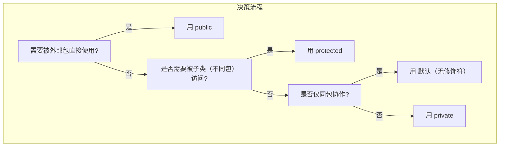

## 在什么情况下使用 `protected` 和 **默认（package-private）** 才是最佳实践？

| 修饰符 | 可见范围 | 典型使用场景 | 为什么是最佳实践 |
|--------|----------|---------------|------------------|
| `protected` | **本类 + 同包类 + 所有子类（即使在不同包）** | 1. 父类中**希望子类能覆盖或访问**的字段/方法<br>2. **框架/库设计**中，允许扩展点<br>3. **模板方法模式**中的钩子（hook） | ① 保持封装（外部包不能直接访问）<br>② 给**继承体系**提供受控扩展点<br>③ 避免 public 的“过度暴露” |
| **默认（无修饰符）** | **仅同包类** | 1. **包内协作**的工具类、常量、辅助方法<br>2. **同一模块/子系统**内部实现细节<br>3. **SPI（Service Provider Interface）** 的实现类 | ① 防止外部包误用内部实现<br>② 包即“模块边界”，天然的访问控制<br>③ 便于重构（包内可随意调整） |

---

## 1. `protected` 最佳实践场景（附代码）

### 场景 A：模板方法模式（父类定义流程，子类实现细节）

```java
// com.company.framework
public abstract class ReportGenerator {
    // 1. 公共入口
    public final void generate() {
        collectData();
        formatHeader();
        formatBody();      // 子类必须实现
        send();            // 可选覆盖
    }

    protected abstract void formatBody();   // 必须由子类实现

    // 2. 可选钩子，子类可覆盖
    protected void formatHeader() {
        System.out.println("=== Default Header ===");
    }

    // 3. 包外不可见，但子类可访问的工具
    protected String sanitize(String input) {
        return input.replaceAll("[<>\"&]", "");
    }
}
```

```java
// com.company.app.pdf
public class PdfReport extends ReportGenerator {
    @Override protected void formatBody() { /* PDF 逻辑 */ }
    @Override protected void formatHeader() { /* 自定义 PDF 页眉 */ }
}
```

> **为什么用 `protected`？**  
> - `formatBody` **必须**被子类实现 → `abstract protected`  
> - `formatHeader` **允许**子类覆盖 → `protected`（默认实现仍可被包内类使用）  
> - `sanitize` 是**内部工具**，只给子类用 → `protected` 防止外部直接调用

---

### 场景 B：框架提供的扩展点（Spring、Hibernate 等）

```java
// org.springframework.web.servlet
public abstract class HandlerInterceptorAdapter implements HandlerInterceptor {
    protected void postHandle(...) { }   // 子类可覆盖
}
```

> 框架不希望外部随意调用 `postHandle`，但**允许开发者继承扩展** → `protected`

---

## 2. 默认（package-private）最佳实践场景

### 场景 A：同一包内的工具类 / 常量

```java
// com.company.util
class StringUtils {                     // 默认访问
    static boolean isBlank(String s) { /* ... */ }
    static String trim(String s)     { /* ... */ }
}
```

```java
// com.company.service
public class UserService {
    void validate(String name) {
        if (StringUtils.isBlank(name)) { /* 同包可见 */ }
    }
}
```

> **为什么默认？**  
> - `StringUtils` 只服务于 `com.company` 包内部  
> - 外部包不需要知道这些实现细节  
> - 包即“模块”，天然边界

---

### 场景 B：SPI 实现类（仅由框架加载）

```java
// com.company.plugin.spi
interface Logger { void log(String msg); }

// com.company.plugin.impl
class ConsoleLogger implements Logger {   // 默认
    public void log(String msg) { System.out.println(msg); }
}
```

```java
// META-INF/services/com.company.plugin.spi.Logger
com.company.plugin.impl.ConsoleLogger
```

> 框架通过 `ServiceLoader` 加载 **同包实现**，外部不应直接 `new ConsoleLogger()`

---

## 3. 决策流程图（何时选哪个？）



---

## 4. 常见误区与避坑

| 误区 | 正确做法 |
|------|---------|
| 把所有字段都设为 `protected` | 仅**子类真正需要**的才 `protected`，其余 `private` |
| 用 `public` 替代 `protected` “以防万一” | 违反**最小权限原则**，增加 API 维护负担 |
| 默认修饰符“看不见”就乱用 | 明确**包是模块边界**，默认 = “包内 API” |

---

## 5. 一句话总结

> - **`protected`：给“继承体系”开后门，只让子类进。**  
> - **默认（package-private）：给“同包兄弟”留便门，外部别想进。**

---

**记忆口诀**：

> **“子类要用 protected，包内协作默认行；  
> 外人想碰？门都没有！”**